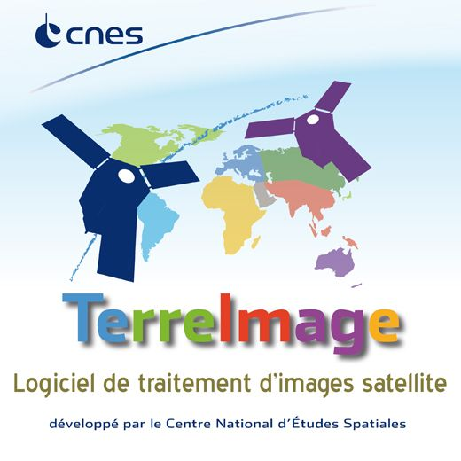

# TerreImage

Ce travail est disponible sous les licences [GPL](Licence_GPL_V3-en.txt) et [CeCILL v2](Licence_CeCILL_V2-fr.txt).

TerreImage s'appuie sur la librairie [Orfeo Toolbox](http://orfeo-toolbox.org/otb/) et sur les plugins suivants:

* [DockableMirrorMap](https://github.com/faunalia/dockablemirrormap)
* [ValueTool](http://hub.qgis.org/projects/valuetool)

